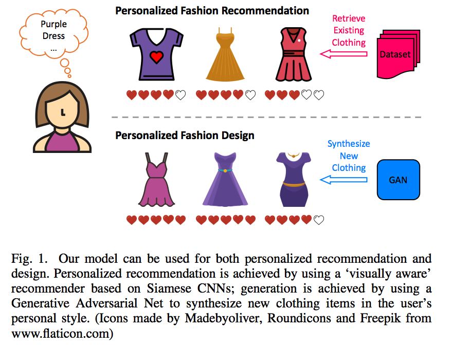

# Personalized Fashion Recommendation and Generation

<p align="center">

</p>

This is our TensorFlow implementation for the paper:

Wang-Cheng Kang, Chen Fang, Zhaowen Wang, Julian McAuley. *[Visually-Aware Fashion Recommendation and Design with Generative Image Models.](http://cseweb.ucsd.edu/~jmcauley/pdfs/icdm17.pdf)* In Proceedings of IEEE International Conference on Data Mining (ICDM'17)

Please cite our paper if you use the code or datasets.

We provide the three modules in our framework: 

- **Deep Visually-Aware Bayesian Personalized Ranking (DVBPR):** Jointly learn user latent factors and extract task-guided visual features from implicit feedback for fashion recommendation.
- **GANs:** A conditional generative adversarial network for fashion generation.
- **Preference Maximization:** Adjust generated images that match a user's personal taste better (personalized fashion design).

## Environment
The code is tested under a Linux desktop with a single GTX-1080 Ti GPU.

Requirements:

- TensorFlow 1.3
- Numpy
- PIL

## Datasets

The four fashion datasets:

- *AmazonFashion (3.3GB)* : 64K users, 234K images, 0.5M actions
- *AmazonWomen (6.2GB)*: 97K users, 347K images, 0.8M actions
- *AmazonMen (2.1GB)*: 34K users, 110K images, 0.2M actions
- *Tradesy (3.4GB)*: 33K users, 326K images, 0.6M actions

can be downloaded via

```
bash download_dataset.sh 
```

All datasets are stored in *.npy* format, each item is associated with a JPG image. Please refer to DVBPR code for detail usage. For image generation, we mainly use the *AmazonFashion* dataset.

Amazon datasets are derived from [here](http://jmcauley.ucsd.edu/data/amazon/), tradesy dataset is introduced in [here](http://jmcauley.ucsd.edu/data/tradesy/). Please cite the corresponding papers if you use the datasets.

**Please note the raw images are for academic use only.**

## Model Training

**Step 1:** Train DVBPR:

```
cd DVBPR
python main.py
```

The default hyper-parameters are defined in *main.py*, you can change them accordingly. AUC (on validation and test set) is recorded in *DVBPR.log*.

**Step 2:** Train GANs:

```
cd GAN
python main.py --train True
```
The default hyper-parameters are defined in *main.py*, you can change them accordingly. Without '--train True', it will load a trained model and generated images for each category (stroed in folder *samples*).

**Step 3:** Preference Maximization:

```
cd PM
python main.py
```

PM is based on pretrained DVBPR and GAN models. It will randomly pick a user for each category, and show the generated images through the optimization process.

With a single GTX-1080 Ti, training DVBPR and GANs take around 7 hours respectively.

## Demo (with pretrained models)
A quick way to use our model is using pretrained models which can be acquired via: 

```
bash download_pretrained_models.sh 
```

With pretrained models, you can see the AUC results of DVBPR, and run GAN and PM code to generate images.

## Misc

- Acknowledgments: GAN code borrows heavily from [DCGAN](https://github.com/carpedm20/DCGAN-tensorflow). GAN networks are modified from [LSGAN](https://arxiv.org/pdf/1611.04076.pdf).
- In principal, our framework can adapt with any GANs variant, we look forward to using advanced GANs to achieve better generation results with higher resolution.
